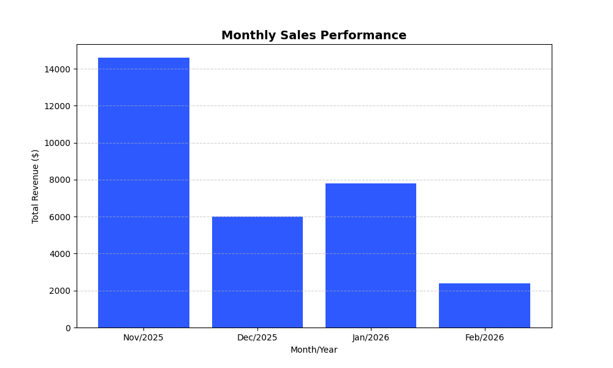

PySQL-SalesInsight 

An automated ETL pipeline that manages sales data using SQL and generates business intelligence reports with Python.

##  Features
- **SQL Persistence:** Secure data storage using SQLite with parameterized queries.
- **Data Analysis:** Monthly growth rate calculation using Pandas.
- **Visualization:** Automatic generation of performance charts with Matplotlib.
- **Professional Exports:** Automatically generates Excel reports and PNG charts.

##  Technologies
- Python 3.x
- Pandas & Matplotlib
- SQLite3

##  How to run
1. Clone the repository.
2. Install dependencies: `pip install pandas matplotlib openpyxl`.
3. Run: `python sales_insight.py`.

